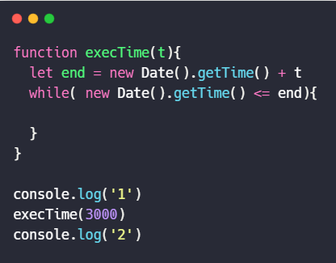

## 第一题
写一个 execTime 函数
参数: 毫秒数
作用: 什么也不做,但函数执行会耗时参数传递的毫秒数

```javascript
function execTime(time) {
  
}
console.log(1) //打印出 1
execTime(3000)
console.log(2) // 3秒后打印出 2

```
**答案**

```javascript
function execTime(time) {
  let end = new Date().getTime() + time
  while(new Date().getTime() <= end){
    
  }
}
console.log(1) //打印出 1
execTime(3000)
console.log(2) // 3秒后打印出 2
```
