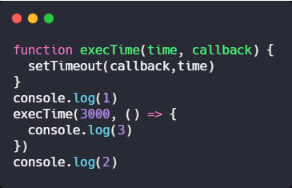

# 第二题

补全 execTime 函数
- 参数:  time: 毫秒数  callback: 回调函数
```javascript
function execTime(time, callback) {
  
}

console.log(1)
execTime(3000, function() {
  console.log(3)
})
console.log(2)
```
**补全 execTime 函数, 执行结果为 立即打印出1和2, 3秒后打印出3**

```javascript
function execTime(time, callback) {
  setTimeout(callback,time)
}
console.log(1) 
execTime(3000,function (){
	console.log(3)  
})
console.log(2) 
```

